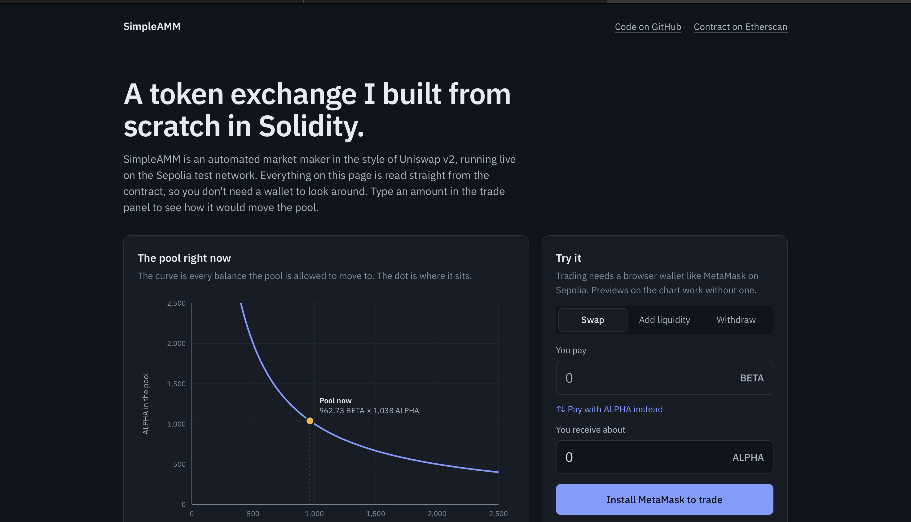
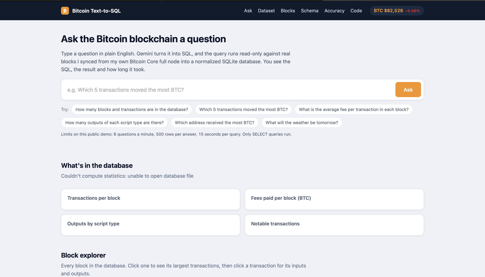

# DeFi & Blockchain Analytics

Two projects in one repository: a token exchange I built from scratch in Solidity, and a plain-English query tool for real Bitcoin data.

| Project | What it is | Live | Code |
|---|---|---|---|
| **SimpleAMM** | Uniswap v2-style exchange (Solidity) with a web interface | [simpleamm-zenish.vercel.app](https://simpleamm-zenish.vercel.app) | [`simple-amm/`](simple-amm/) · [`amm-web-ui/`](amm-web-ui/) |
| **Bitcoin Text-to-SQL** | Ask questions about Bitcoin blocks in English, get SQL and data | [Live demo](http://18.224.206.193:8080) | [`bitcoin-text-to-sql/`](bitcoin-text-to-sql/) |

## Skills shown

| Area | What these projects use |
|---|---|
| Smart contracts | Solidity, ERC-20, constant-product AMM math, Hardhat tests, 100% coverage |
| Web3 frontend | React, Vite, Ethers.js v6, MetaMask, reading event logs (`eth_getLogs`) |
| Blockchain data | Bitcoin Core RPC, data modeling (blocks, transactions, inputs, outputs) |
| Backend and data | Python, SQLite, SQL, Flask |
| AI | LLM Text-to-SQL with Gemini, prompt design, accuracy benchmark |
| DevOps | Docker, AWS EC2, Vercel |

## Requirements

| Project | You need |
|---|---|
| SimpleAMM contracts | Node.js 18+ and npm |
| SimpleAMM web interface | Node.js 18+. To trade: MetaMask on Sepolia and a little free Sepolia ETH |
| Bitcoin Text-to-SQL | Python 3.10+, a [Gemini API key](https://aistudio.google.com/apikey) (free), and a `bitcoin.db` built with `ingest.py` from a Bitcoin Core node |

---

## SimpleAMM



- A constant-product (x·y = k) market maker: deposit, swap and withdraw, with a **0.30% fee** and transferable **ERC-20 LP tokens**.
- **100% line and branch test coverage** with Hardhat.
- The web interface reads the pool from Sepolia **without a wallet**, previews any trade on the curve before you send it, and rebuilds price history from the contract's event logs. With MetaMask on Sepolia you can mint free test tokens and trade.

```bash
# contracts and tests
cd simple-amm && npm install && npx hardhat test && npx hardhat coverage

# web interface
cd amm-web-ui && npm install && npm run dev      # http://localhost:5173
```

Details: [simple-amm/README.md](simple-amm/README.md) · [amm-web-ui/README.md](amm-web-ui/README.md)

---

## Bitcoin Text-to-SQL



- Blocks synced from my own **Bitcoin Core full node** over RPC into a normalized **SQLite** database (blocks, transactions, inputs, outputs).
- **Gemini** turns a question into SQL, which runs **read-only** with time and row limits. **9 of 12** correct on my benchmark, wrong answers included on the page.
- Also has a dataset overview, a block and transaction explorer, and a schema browser.

```bash
cd bitcoin-text-to-sql
pip install -r requirements.txt
export GEMINI_API_KEY=your_key
python chat_ui.py --db bitcoin.db                 # http://localhost:5000
```

Details: [bitcoin-text-to-sql/README.md](bitcoin-text-to-sql/README.md)

---

## Layout

```
DeFi-Blockchain-Analytics/
├── simple-amm/            AMM contracts and tests
├── amm-web-ui/            React interface (live on Vercel)
└── bitcoin-text-to-sql/   node sync, Text-to-SQL web app, benchmark
```

## License

MIT, see [LICENSE](LICENSE).

**Zenish Borad** · [LinkedIn](https://www.linkedin.com/in/zenish-borad) · [GitHub](https://github.com/Zenish2001) · borad.z@northeastern.edu
